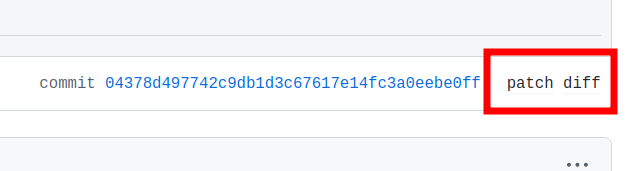

# 代码规范

这一章描述一些大家推荐的惯用规范。

## 建议

### 1. 上游优先级最高

你对代码的所有修改都先提交给上游，然后你可以在 PKGBUILD 里引用你发 PR 的 patch。
提交给上游的代码会加钱。

如果 PKGBUILD 在 x86-64 也 FTBFS，一定要到 archlinux 报 BUG，这个也加钱。
你可以参考[这篇文章](./5-bug-report.md)来了解汇报 BUG 的流程。

如果这个 patch 里的错误或者你对源码的修改反馈给了上游或者交给了 Arch Linux，
要在给仓库的 PR 里注明提交给上游的链接，或者给 Arch 的 BUG Report 链接。

### 2. 给所有的修改注释

尽量在 commit message，或者 pr 里写清楚修改的原因。
讲清楚“为什么”属于我们工作流的一部分。
一是为了以后方便维护，看着这个修改就知道原因。
还有就是能帮助新人，让他们来仓库查相关错误时能快速检索。

修改 PKGBUILD 中的内容也需要写清楚修改原因，
比如添加 make 参数， 修改 cflags 之类的。
用 `#` 在修改旁注释需要写一下这么修改的原因。

## PR 的流程

1. 每一次修改都从 master 分支的头创建一个新的分支，分支名可以随意，
通常我们用包的名字来当分支名。
2. 创建一个和包名字同名的文件夹，把从 PKGBUILD 生成的 riscv64.patch 文件，
和对源码修改的 patch 放在同一个文件夹。
3. commit 并发起 PR

### Commit Title

- 如果当前仓库没有这个包的 patch，标题用 `addpkg: pkgname`
- 如果你的 PR 是对原有包的修改，标题用 `upgpkg: pkgname`
- 如果你的 PR 是删除掉仓库内的 patch，标题用 `rmvpkg: pkgname`

同时强烈建议不要只用 `git commit -m "title"`，建议在 commit body 里
写清楚这次修改的内容和原因。然后在 PR 的信息里也要写清楚。

## 如何创建 patch

- 如果你还未 stage 修改：

```bash title=bash
git diff --no-prefix > riscv64.patch
```

- 如果你已经 stage 了修改

```bash title=bash
git diff --no-prefix --cached > riscv64.patch
```

`--no-prefix` 参数会去掉前缀的 `a/ b/` 路径字符。

## patch 的格式问题

用上述方法打出来的补丁通常是以下的格式：

```diff title=riscv64.patch
diff --git trunk/PKGBUILD trunk/PKGBUILD
--- trunk/PKGBUILD
+++ trunk/PKGBUILD
```

你需要删除掉所有的 `trunk` 字符：

```diff title=riscv64.patch
diff --git PKGBUILD PKGBUILD
--- PKGBUILD
+++ PKGBUILD
```

```bash
git diff --no-prefix | sed 's/trunk\///' > riscv64.patch
```

也可以用下面这个脚本来直接去除这些字符：

```bash title=console
git diff --no-index --no-prefix PKGBUILD.orig PKGBUILD | filterdiff --clean --strip=1 > riscv64.patch
```

## 提交 PR 的一些格式注意事项

### 数组的格式

```bash title=PKGBUILD
source=("http://www.frodo.looijaard.name/system/files/software/${pkgname}/${pkgname}-${pkgver}.tar.gz"
        "psiconv.patch") # <- 注意括号要跟在最后一个文件后，不要创建新行
       #^
       # 注意这里要对齐

md5sums=('286e427b10f4d10aaeef1944210a2ea6'
         '4fb974d3ae3058de435050d1595f269b')
```

> Reference:
> https://github.com/felixonmars/archriscv-packages/pull/148/commits/839b90f662cc942f9c1b1f80284d93e4d48dd5a5

### 不要提交对 arch 的修改

肥猫的构建脚本会把这个处理好，在 PR 的时候不用提交对 arch 的修改。

> Reference:
> https://github.com/felixonmars/archriscv-packages/pull/488/commits/116365a132e9e973ab152514d59ed6688fdc3799

## 其他规范

### `source` 上游文件名问题

建议给 src 引用的文件取独特的名字，比如

`${pkgname}-xxxpatch::https://...`

因为从 source 数组里下载的文件都会放进 SRCDEST 里，有概率和别的包下载的东西同名，
然后 archbuild 以为下载过了就直接用，然后 checksum 就对不上了。

### 上游已经修复编译错误但还没发版本

记得测试一下 x86 会不会有编译失败的问题，优先给 Arch Linux 提交补丁。

- 用 cherry-pick

```diff title=PKGBUILD
 prepare() {
   cd $pkgname
+  git cherry-pick -n 508c0f94e5f182e50ff61be6e04f72574dee97cb  # patch: Don't alter or try to write [GtkChild] fields
+  git cherry-pick -n e8a0aeec350ea80349582142c0e8e3cd3f1bce38  # patch: Reference of [GtkChild] fields is handled by GtkBuilder, type must be unowned
 }
```

- 直接从上游下载 patch

```diff title=PKGBUILD
+source=(https://github.com/MegaGlest/megaglest-source/releases/download/${pkgver}/megaglest-source-${pkgver}.tar.xz{,.asc}
+        ftp-fixes.patch::https://github.com/MegaGlest/megaglest-source/commit/5a3520540276a6fd06f7c88e571b6462978e3eab.patch)

+prepare() {
+  cd megaglest-${pkgver}
+
+  patch -Np1 -i ../ftp-fixes.patch
+}
```

> Reference:
>
> * https://github.com/felixonmars/archriscv-packages/pull/165
> * https://github.com/felixonmars/archriscv-packages/pull/345
> * https://github.com/felixonmars/archriscv-packages/pull/348
> * https://github.com/felixonmars/archriscv-packages/pull/405

> Tips: 如何把 PR 的内容以 patch 形式下载
>
> 找到 PR 的那条 commit，在 URL 后边加 .patch/.diff 就能拿到 raw contents。
> 比如
> [PR #470](https://github.com/felixonmars/archriscv-packages/pull/470/commits/95242a8b610854ef64c8b5e304756ba6a4d4302d),
> 去掉 commit 后的那一串，直接加上 .patch。
>
> ```diff title=diff
> -...kages/pull/470/commits/95242a8b610854ef64c8b5e304756ba6a4d4302d
> 
> +...kages/pull/470.patch
> ```
> 现在 GitHub 也已经提供了超链接跳转，点击即可跳转。



### 本地版本过老

假设上一次发布的版本特别老，主线做了很多修改，然后引用的修复 patch 行数不对应，
和源码冲突的话，优先发 issue 催上游发新版本。

### 修改 PKGREL

pkgrel 不能超过 x86 主线，如果需要重新打包，推荐以 0.1 为递增值逐次往上加。
